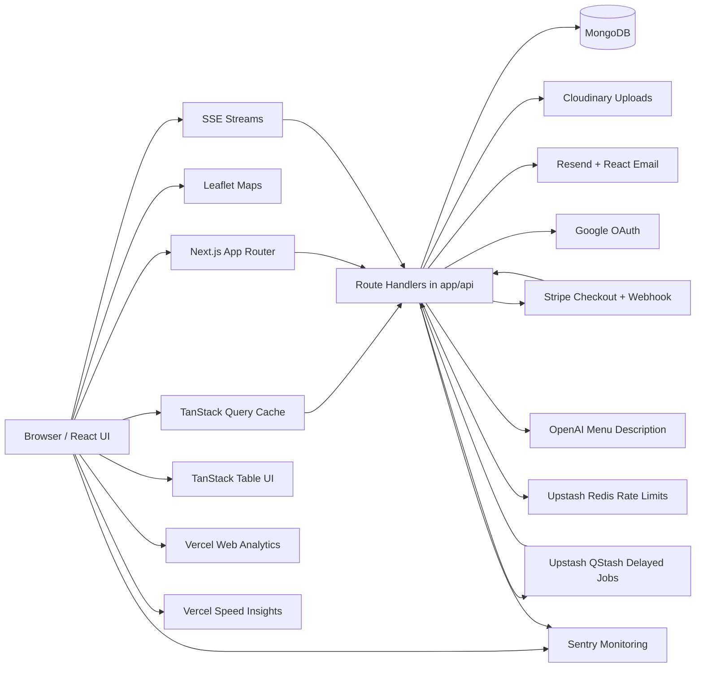
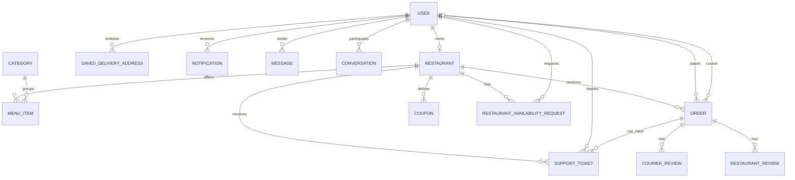
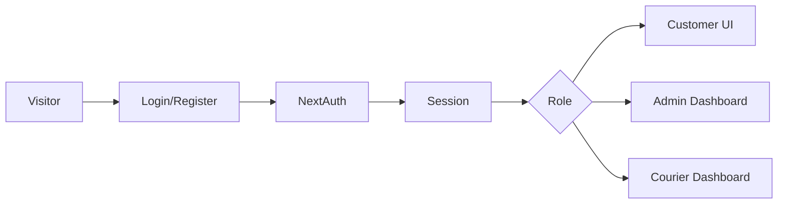
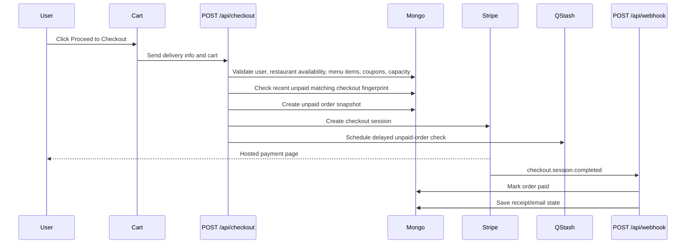
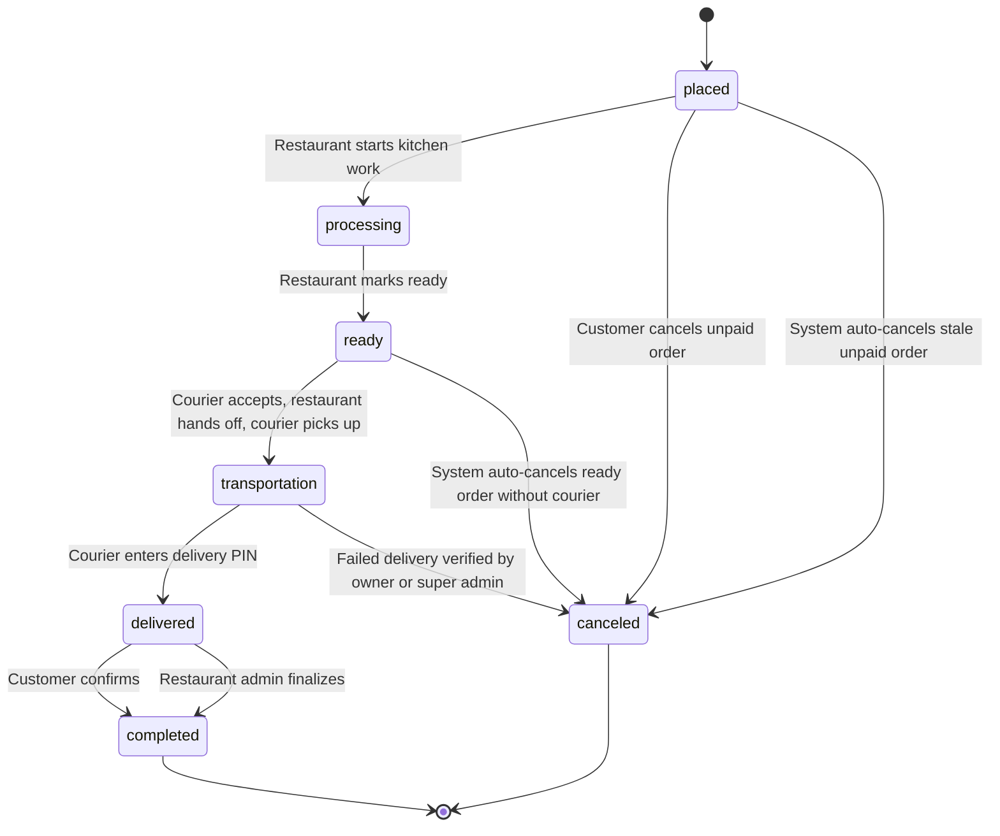
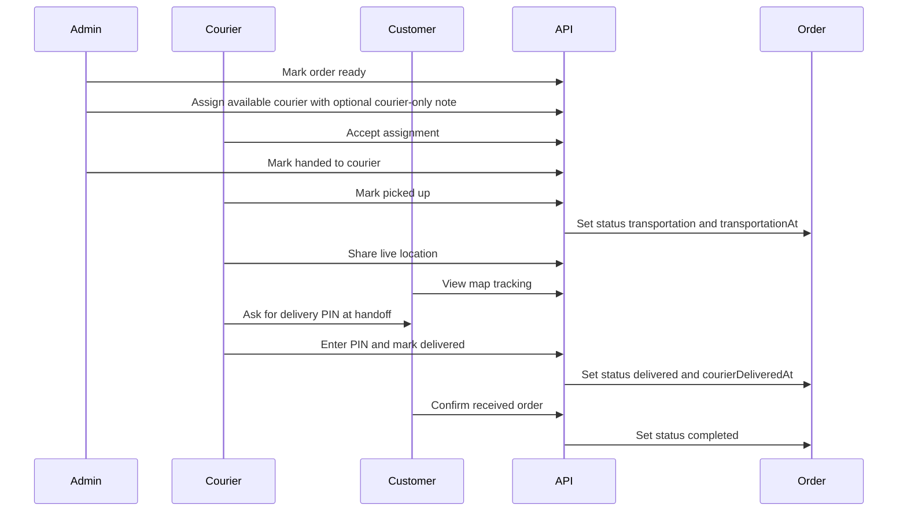
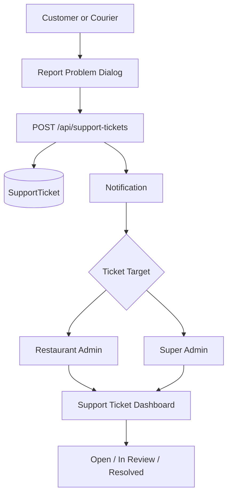
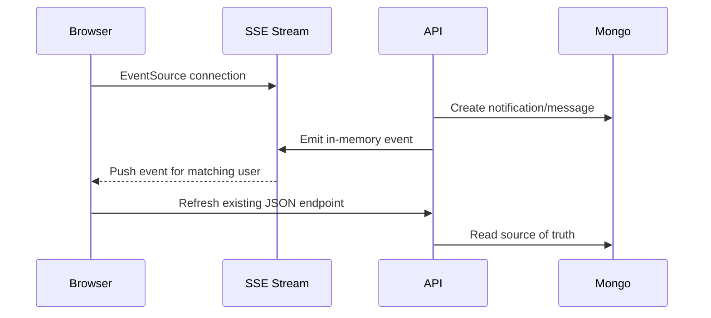

# Architecture

This document explains how the food ordering app is organized, how the main systems talk to each other, and how the important workflows move through the app.

## System Overview

The app is a full-stack Next.js App Router application. Pages, server route handlers, API logic, and UI live in the same repository. MongoDB stores the application data through Mongoose models. External services handle payments, media uploads, email, OAuth, AI text generation, rate limiting, and maps. Shared helpers centralize money arithmetic, phone normalization, and timezone-aware display dates.



## Main Technology Layers

- `app/`: Next.js routes, pages, layouts, loading states, and API route handlers.
- `components/`: shared UI components and shadcn/Radix primitives.
- `contexts/`: client-side global state for cart, notifications, and messages.
- `hooks/`: client hooks such as profile and favorites data loading.
- `libs/`: auth, database, notifications, messages, coupons, loyalty, email, AI, rate limiting, date formatting, and helper utilities.
- `models/`: Mongoose schemas and MongoDB collection contracts.
- `types/`: reusable TypeScript domain models, DTOs, and API response contracts shared across pages, components, contexts, and server helpers.
- `__tests__/`, `e2e/`, `mocks/`: Vitest unit/integration/e2e test areas.

## Client UX Shell

`app/layout.tsx` mounts the cross-cutting client tools used by the frontend:

- `NuqsAdapter` enables URL-backed client state through `nuqs`.
- `AppCommandPalette` uses `cmdk` for global route/action search from the header or `Ctrl/Cmd + K`.
- `AppErrorBoundary` uses `react-error-boundary` and sends caught render errors to Sentry.
- `Analytics` from `@vercel/analytics/next` records production traffic on Vercel.
- `SpeedInsights` from `@vercel/speed-insights/next` records real-user Web Vitals and route performance on Vercel.
- `TanStackDataTable` uses TanStack Table for reusable searchable, sortable, paginated data-table UI.
- `sharp` is installed for Next.js image optimization and is used automatically by the framework.
- `libs/money.ts` wraps `currency.js` for precise checkout, coupon, earnings, delivery fee, and report calculations.
- `libs/phone.ts` wraps `libphonenumber-js` so profile and checkout phones are validated and stored in E.164 format.
- `libs/dateFormat.ts` uses `date-fns` with `@date-fns/tz` so UI, email, and PDF dates render in the app timezone.

`nuqs` is currently used where refreshed or shared URLs should preserve UI state: public menu filters, restaurant menu filters, restaurants search/page, customer orders, customer reports, admin orders, admin users, admin menu items, support ticket filters, and restaurant report period/date filters.

TanStack Table is currently used for larger list views that benefit from client-side search, sorting, pagination, and column visibility controls: `/admin-dashboard/orders`, `/admin-dashboard/users`, `/admin-dashboard/menu-items`, `/admin-dashboard/audit-logs`, and `/my-orders`. Order detail item tables on `/admin-dashboard/orders/[id]` and `/my-orders/[id]` use a simple TanStack mode without toolbar or pagination so the read-only receipt-style layout stays quiet.

## Application Areas

```mermaid
flowchart TD
  App[Next.js App]

  App --> Public[Public pages]
  App --> Customer[Customer flows]
  App --> Admin[Admin dashboard]
  App --> Courier[Courier flows]
  App --> Api[API routes]
  App --> Shared[Shared components]

  Public --> Menu["/menu and restaurant pages"]
  Public --> Auth["/login, /register, email verification"]

  Customer --> Cart["/cart"]
  Customer --> MyOrders["/my-orders"]
  Customer --> Favorites["/favorite-meals, /favorite-restaurants"]
  Customer --> Reviews["/reviews"]
  Customer --> Messages["/messages"]

  Admin --> Restaurant["/admin-dashboard/restaurant"]
  Admin --> Reports["/admin-dashboard/restaurant-reports"]
  Admin --> MenuItems["/admin-dashboard/menu-items"]
  Admin --> Orders["/admin-dashboard/orders"]
  Admin --> Tickets["/admin-dashboard/support-tickets"]
  Admin --> Users["/admin-dashboard/users"]
  Admin --> Stats["/admin-dashboard/statistics"]

  Courier --> MyDelivery["/my-delivery"]
  Courier --> MyDeliveries["/my-deliveries"]
  Courier --> CourierDashboard["/courier-dashboard"]
```



## Data Model Map

The important persistent models are:

- `User`: account, role, profile fields, saved delivery addresses, courier availability/location, restaurant ownership, favorites.
- `Restaurant`: owner, location, contact, images, working hours, blocked dates, tax, courier fee, preparation/delivery estimates, active order limit, max items per order.
- `MenuItem`: restaurant item, category, image, prices, availability, max quantity per order.
- `Order`: customer delivery details, cart snapshot, payment data, restaurant fee/tax snapshots, coupon/loyalty snapshots, estimate snapshots, status timeline timestamps, courier, delivery PIN, completion state.
- `Coupon`: restaurant-scoped discounts and validity rules.
- `RestaurantReview` and `CourierReview`: one review per completed order flow.
- `Notification`: role-aware notifications with read state and metadata routing.
- `Conversation` and `Message`: approved in-app messaging threads and messages.
- `SupportTicket`: reported order, delivery, restaurant, or app issues.
- `RestaurantAvailabilityRequest`: customer requests to be notified when a blocked restaurant can accept orders again.
- `Category`: menu categories managed by super admin.



## Authentication And Roles

Authentication uses NextAuth. Credentials users can go through email verification and password reset flows. Google OAuth users are handled through the NextAuth Google provider.

Upstash Redis rate limiting protects sensitive auth routes and credentials login from repeated abuse. The counters are short-lived and do not replace MongoDB user data.

Roles:

- `user`: customer account.
- `admin`: restaurant owner or super admin.
- `courier`: delivery account.

Super admin is identified by `NEXT_PUBLIC_SUPER_ADMIN_EMAIL` in the UI and optionally `SUPER_ADMIN_EMAIL` server-side.

Super-admin user deletion is handled as a guarded cleanup workflow instead of a blind document delete. The workflow blocks deletion while the target account is still involved in active customer orders, courier deliveries, or owned restaurant orders. When deletion is safe, historical `Order` documents remain as immutable snapshots, while owned restaurant data, menu items, coupons, availability requests, Cloudinary media, authored reviews, courier reviews for the deleted courier, user notifications, and favorite references are cleaned up. Support tickets are retained for operational history, but reporter identity fields are anonymized.



## Checkout And Payment Flow

Checkout is intentionally server-authoritative. The cart can show warnings, but `/api/checkout` validates the final truth before creating a Stripe session.

Key checks:

- User must be signed in.
- Cart must not be empty.
- Cart items must belong to one restaurant.
- User cannot order from their own restaurant.
- User cannot start another checkout while a previous delivered order still needs customer confirmation.
- Menu items must still exist and be available.
- Public menu surfaces can call `/api/restaurants/[id]/ordering-status` before adding an item to the cart, so users get early feedback before checkout.
- Restaurant must currently accept orders based on working hours, the 60-minute-before-closing checkout cutoff, pause state, blocked dates, delivery radius, and active kitchen capacity.
- Restaurant active kitchen order count must be below `activeOrderLimit`.
- Total cart quantity must be at or below `Restaurant.maxItemsPerOrder`, and repeated quantities for the same menu item across sizes must stay at or below `MenuItem.maxQuantityPerOrder`.
- Coupon and loyalty discounts are validated server-side.
- Best coupon suggestions shown in cart are revalidated at checkout before Stripe is created.
- Recent identical unpaid `placed` checkout attempts are matched by `checkoutFingerprint`; the app reuses or recovers the existing Stripe Checkout session instead of creating duplicate orders.
- System cancellation of stale unpaid orders attempts to expire the open Stripe Checkout session so an old hosted payment page cannot pay a canceled order.
- Customer cancellation of an unpaid `placed` order uses the same Stripe Checkout session expiration helper.
- Reorders rebuild cart items from current `menu_items` records so deleted, unavailable, cross-restaurant, or changed-price items cannot silently proceed.
- Restaurant details and favorite restaurant cards can quick reorder the latest previous order from that restaurant using the same current `menu_items` validation.
- Customers can request back-online notifications for restaurants blocked by closed, paused, closing-soon, or busy checkout states.
- Customers can reuse saved delivery addresses from `/api/profile/delivery-addresses`; duplicate saved-address attempts reuse the existing address, and checkout still validates the final delivery payload and radius server-side.



## Order Lifecycle

Orders move through a controlled status flow.



Timing fields on `Order` capture the real phase timestamps:

- `processingAt`
- `readyAt`
- `transportationAt`
- `courierDeliveredAt`
- `customerConfirmedDeliveryAt`
- `adminConfirmedDeliveryAt`
- `completedAt`
- `canceledAt`
- `failedDeliveryRequestedAt`
- `failedDeliveryVerifiedAt`

Estimate snapshots are saved on each order:

- `estimatedPreparationMinutes`
- `estimatedDeliveryMinutes`
- `estimatedTotalMinutes`

This lets the order timeline compare expected timing against actual progress.
Active customer order detail pages use `libs/orderDelay.ts` to warn when elapsed time exceeds the saved estimated total plus the grace window. Development-only simulated timeline offsets can feed that warning without changing MongoDB timestamps.

Operational monitoring builds on the same timestamps:

- `/api/orders/queue` returns active paid orders grouped by lifecycle phase.
- `/api/restaurant/operations` returns the restaurant operations overview used by `/admin-dashboard/operations`.
- `/admin-dashboard/operations` summarizes active order stages, kitchen capacity, restaurant open/paused/closing status, courier availability, today revenue, unpaid/canceled counts, quick actions, and orders needing attention.
- `/admin-dashboard/orders` surfaces late-order alerts and links admins to `/admin-dashboard/order-queue`.
- Ready orders without a courier show an admin warning after 15 minutes.
- Pending courier assignments expire after 10 minutes if the courier does not accept or decline; the courier is released and restaurant admins are notified to reassign.
- Accepted, declined, and expired courier assignment attempts are appended to order assignment history so courier reliability metrics remain accurate after reassignments.
- Stale unpaid orders auto-cancel after 30 minutes and show a customer-facing payment countdown; ready orders without a courier auto-cancel after 60 minutes.
- Upstash QStash schedules delayed checks for stale unpaid orders, unanswered courier assignments, and ready orders without a courier so production order maintenance is not dependent only on a later page/API read.
- System auto-cancellations mark the order unpaid, store `canceledBy: system`, add `cancellationReason`, notify customer/admins, and write an audit log.
- For stale unpaid orders, system auto-cancellation also tries to expire the open Stripe Checkout session; failures are recorded as audit metadata and do not stop the local cancellation.
- ETA-style notifications reuse estimate snapshots so status changes can include useful preparation or delivery timing.
- `OrderProgressStepper` gives customers and admins a compact visual stage tracker for placed, kitchen, transport, and delivered phases.

## Delete Protection

Restaurant and menu data can be edited while orders are active, but destructive deletes are blocked when active order records still depend on that data.

- `libs/orderDeletionGuards.ts` centralizes active-order lookup for restaurant and menu item deletion.
- `DELETE /api/menu-items` returns `409` when an active order still references the item snapshot; admins should mark the item unavailable first.
- `DELETE /api/restaurant` returns `409` when the restaurant still has active orders.
- `DELETE /api/profile` also blocks restaurant-owner account deletion when the owned restaurant still has active orders.

## Delivery And Courier Flow



If the customer does not confirm, the restaurant owner can finalize delivery from the admin order detail page.

If the customer is unavailable after at least 30 minutes in transport, the courier can request failed-delivery cancellation. The order remains in `transportation` until the restaurant owner or super admin verifies the cancellation; verification sets the order to `canceled` and releases the courier from `takenOrder`.

Courier delivery views show estimated travel time without tracking total route mileage. Completed delivery history can summarize completed deliveries, accepted assignments, declined assignments, missed assignments, response rate, average response time, average delivery minutes, late deliveries, ratings, and earnings.

## Support Ticket Flow

Customers and couriers can report a problem from the order or delivery UI. Admins manage tickets in `/admin-dashboard/support-tickets`.



Rules:

- Restaurant support tickets are visible to the restaurant owner for the related restaurant.
- App support tickets route to the super admin.
- Ticket updates are admin-only.

## Notifications And Messaging

Notifications are stored in MongoDB and loaded through `NotificationsContext`. Notification routing is role-aware through `libs/notificationClient.ts`.

Important notification examples include order placement, payment, order status changes, ETA-style phase updates, courier assignment, support ticket creation, late active-order warnings, and delivery completion prompts.

Failed-delivery review notifications are admin-facing operational items and resolve to `/admin-dashboard/orders/[id]`; customer order notifications continue to resolve to customer order pages.

Restaurant availability notifications are customer-facing and resolve to `/restaurants/[id]`. Waiting requests are stored in `restaurant_availability_requests` and marked notified after the restaurant can accept orders again.

Messages are app-native conversations, not open public chat. The allowed role combinations are enforced in `libs/messages.ts`.

Important messaging rules:

- Customer-to-customer chat is blocked.
- Customer conversations are tied to allowed order contacts.
- Couriers can message admins.
- Admins can message approved contacts.
- Conversations and messages are persisted in MongoDB.

## Realtime Updates

The app uses SSE for lightweight server-to-browser updates. It does not require new npm packages, extra environment variables, or a third-party realtime service.

SSE endpoints:

- `/api/messages/stream`: emits message-created, message-updated, hidden, and read events for the signed-in participant.
- `/api/notifications/stream`: emits notification-created and read-state events for the signed-in recipient.



SSE is used as an instant refresh signal, while MongoDB remains the source of truth. Shared profile data, favorite IDs/lists, notification/message sound settings, message inbox/thread views, and global message/notification unread state are cached through TanStack Query and refreshed by invalidating shared keys from `libs/queryKeys.ts`.

Existing polling stays as fallback on notifications, messages, order details, admin order list/queue, and courier active delivery screens. When an SSE stream drops, active TanStack Query observers continue to poll their existing JSON endpoints.

## Media, Email, AI, And Maps

- Cloudinary stores uploaded user, restaurant, and menu item media.
- Resend and React Email send transactional auth and purchase receipt emails.
- OpenAI generates menu item descriptions through a server-only API route.
- Upstash QStash calls verified server-only API routes later for delayed order maintenance.
- Leaflet renders restaurant, customer, and courier map views.

## Observability

Sentry is configured for browser, Node.js server, and edge runtimes.

- `instrumentation-client.ts`: browser errors, tracing, route transitions, and privacy-masked Session Replay.
- `sentry.server.config.ts`: server/API/App Router runtime errors and traces.
- `sentry.edge.config.ts`: edge runtime errors and traces.
- `instrumentation.ts`: loads the correct runtime config and exports `onRequestError`.
- `app/global-error.tsx`: captures root App Router render errors that Next.js catches before global handlers.

Production source maps are uploaded through `withSentryConfig` in `next.config.ts` when `SENTRY_AUTH_TOKEN` is available during build. Keep `SENTRY_AUTH_TOKEN` secret; `NEXT_PUBLIC_SENTRY_DSN` is intentionally public for browser events.

Vercel Web Analytics is mounted in `app/layout.tsx` through `@vercel/analytics/next`. Vercel Speed Insights is mounted through `@vercel/speed-insights/next` for real-user Web Vitals and route performance. Analytics tracks traffic, Speed Insights tracks performance, and Sentry remains responsible for errors, traces, and replay debugging.

## Restaurant Reports

Restaurant owners can open `/admin-dashboard/restaurant-reports` to generate daily, weekly, and monthly summaries from existing order data.

Reports include:

- order counts by paid, unpaid, completed, canceled, and active state
- gross paid revenue, net revenue, canceled value, average order value, tax, delivery fees, coupon discounts, and loyalty discounts
- payment, completion, and cancellation percentages
- top sold menu items for the selected period

Empty periods return zeros for counts, money, and percentages. The PDF download button is disabled in the UI for empty periods, and the PDF API also rejects empty exports.

## Date Formatting

MongoDB remains the source of truth for timestamp fields as `Date` values. API routes should serialize date fields as ISO strings or raw date values, and UI/email/PDF layers should format those values through `libs/dateFormat.ts`.

User-facing dates use `dd/MM/yyyy`. User-facing date-time values use `dd/MM/yyyy HH:mm`.

## Testing Strategy

The project uses Vitest.

- Unit and route tests live in `__tests__/`.
- Database-backed e2e tests live in `e2e/`.
- Shared test fixtures and mocks live in `mocks/`.

Recommended commands:

```bash
npm run lint
npm run test
npm run test:api
npm run test:libs
npm run test:file -- __tests__/api/checkout.route.test.ts
npm run test:e2e
```

For risky areas, prefer focused route tests first:

- auth and role guards
- checkout and Stripe webhook behavior
- restaurant availability, best coupon suggestion, and reorder validation
- order lifecycle and delivery confirmation
- support ticket authorization
- courier assignment, location updates, delivery metrics, and earnings summaries

## Documentation And AI Guidance

The repository keeps documentation close to code changes so future contributors and AI tools share the same mental model.

- Update this file when a change affects system architecture, data models, lifecycle diagrams, integration boundaries, background jobs, realtime behavior, or cross-module data flow.
- Update `DESCRIPTION.md` when role behavior or business rules change.
- Update `README.md` when setup, packages, environment variables, public routes, or high-level capabilities change.
- Update `TESTING.md`, `__tests__/README.md`, or `e2e/README.md` when test commands, fixtures, coverage areas, or test layers change.
- Keep `AGENTS.md`, `CLAUDE.md`, `GEMINI.md`, `.claude/project-instructions.md`, `.gemini/project-instructions.md`, `.cursor/rules/project-conventions.mdc`, and `.windsurf/rules/project-conventions.md` aligned when workflow-critical instructions change.
- Avoid adding new AI-tool folders unless the project actually uses that tool.
